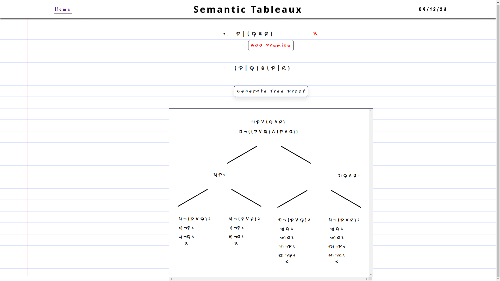
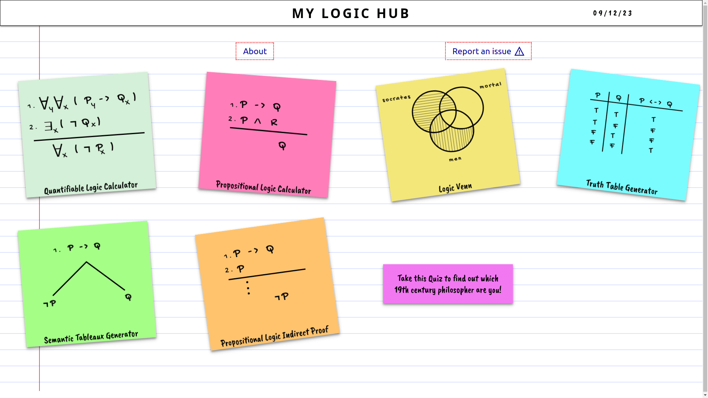
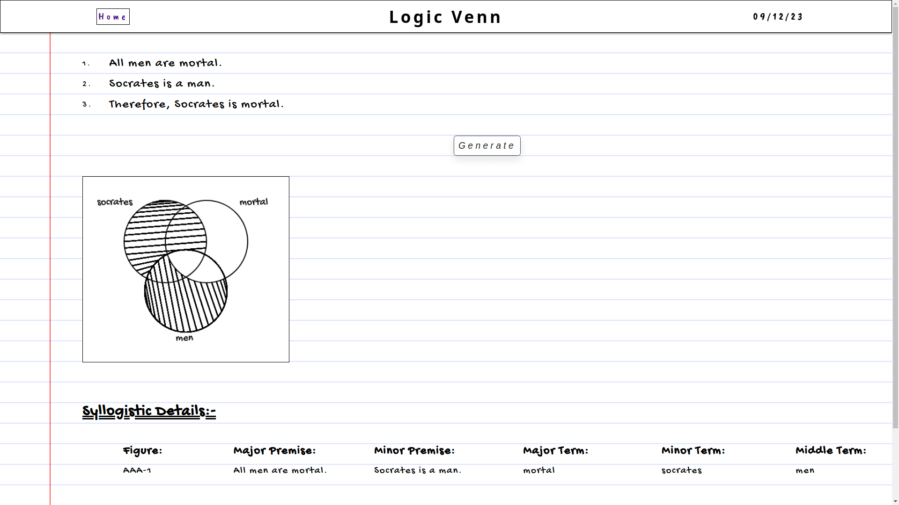

  
  
  
  
  

# My Logic Hub (Beta)

Welcome to the My Logic Hub, an automated reasoning tool for performing various logical calculations. This app is built primarily using Test-Driven Development (TDD). This app is currently in beta, and I appreciate your feedback and support as I continue to improve it.

## Website

You can check out a the My Logic Hub App [here](https://mylogichub.com).

**[Coding Strategies and Decisions](coding-strategies.md):** Explore the document detailing the key coding strategies and important decisions that shape our project's development.

## Table of Contents

- [Features](#features)
- [Getting Started](#getting-started)
- [Usage](#usage)
- [Known Issues](#known-issues)
- [Contributing](#contributing)
- [License](#license)

## Features

- Multiple Logical Calculators: The app provides various logical calculators, each tailored for different types of logical operations.
- Beta Version: Please note that this is a beta version, and some features may be in progress or experimental.
- User-Friendly Interface: The app offers an intuitive and user-friendly interface for performing logical calculations.

## Getting Started

To get started with the Logical Calculator App, follow these steps:

1. Clone or download the repository to your local machine.
2. Install any necessary dependencies using npm or yarn.
3. Run the app on your local development environment.

## Tests

My Logic Hub includes a comprehensive test suite to ensure its functionality remains reliable. I used [Jest](https://jestjs.io/) as the test runner and [React Testing Library (RTL)](https://testing-library.com/docs/react-testing-library/intro/) for testing React components.

### Running Tests

To run the tests, follow these steps:

1. Make sure you have installed all the project dependencies as mentioned in the "Getting Started" section.

2. In your terminal, run the following command:

   npm test

### Available Logical Calculators

The app currently offers the following logical calculators:

1. **First Order Logic Calculator**: Generate Fitch style deduction steps for FOL arguments.
2. **Propositional Logic Calculator**: Generate Fitch style deduction steps for propositional logic arguments.
3. **Semantic Tableaux Generator**: Generate a semantic tableaux for propositional logic.
4. **Propositional Logic Indirect Proof Generator**: Generate a Fitch style propositional logic indirect proof.
5. **Logic Venn**: Generate Venn Diagrams and validity details for a syllogistic argument.
6. **Truth Table Generator**: Generate a truth table for a propositional logic formula.

### In Progress

Please note that some calculators may be in progress or experimental in this beta version. I am actively working on improving and adding more features.

## Known Issues

While we strive to provide a stable and user-friendly experience, there may be known issues in this beta version. Please refer to the project's issue tracker on GitHub for the most up-to-date information.

## Contributing

I welcome contributions from the community. If you'd like to contribute to the development of this app, please follow our [contributing guidelines](CONTRIBUTING.md).

## Copyright

Copyright © 2023 Fouzan Tariq(tariqfouzan@gmail.com)

You may modify and distribute this software under the terms of the GNU General Public License v3. See the [LICENSE](LICENSE) file for details.

---

Thank you for using the My Logic Hub (Beta). I appreciate your feedback and hope you find this tool useful for your logical calculations.
