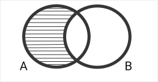

# Coding Strategies and Decisions

Welcome to the document on coding strategies and important decisions that shape my project's development. This document serves as a valuable resource where I discuss the key approaches, methodologies, and considerations that guide my coding practices.

**Note:** Please be aware that this document is a work in progress. Not all important strategies are reflected here as of now. I am continually refining my strategies and documenting my decisions as this project evolves. Feel free to revisit this document to stay updated on my latest coding insights and approaches.

## Table of Contents

- [Expand Knowledge Base](#expand-knowledge-base)
- [Check Knowledge Base](#check-knowledge-base)
- [The Restriction on UG](#the-restriction-on-uguniversal-generalization)
- [Get Deduction Steps](#get-deduction-steps)
- [Why not Skolemization](#why-not-skolemization)
- [Shading of the Venn Diagrams](#shading-of-the-venn-diagrams)

## Expand Knowledge Base:

This is an implementation of a forward chaining algorithm. The current contents of the knowledge are tested for simplification. They are run with all the other contents, (including itself) to see if, from either of the two premises or from the premise itself, a third one can be deduced. It only works to simplify the current contents of the premises to avoid unnecessary expansion. It simplifies [P ∧ Q] into [P] and [Q] but does not deduce [P ∧ Q] from [P], [Q] since this would unnecessarily lead to a potentially infinite knowledge base. If [P ∧ Q] is needed anywhere in the premises, a backward chaining algorithm check knowledge base conjoins [P], [Q].

## Check Knowledge Base:

This is an implementation of a backward chaining algorithm. It is passed a conclusion, and it tries to reach the conclusion by breaking down the wff(well-formed formula) into smaller parts and recursively calling itself with the base case of searching in the knowledge base for only primitive wffs that are necessary to reach the conclusion and returning the respective Boolean. For example, the premise [P -> Q] may be reduced to either [¬P] or [Q], since on either of the primitive wffs [¬P], [Q], we can use addition and then material implication to reach the desired conclusion of [P -> Q].

## The Restriction on UG(Universal Generalization):

One of the restrictions on universal generalization prevents from generalizing over a constant that was existentially instantiated. This prevents from making fallacious inferences from “some man is happy” to “JQ is happy” to “everyone is happy.”
This was(is?) somewhat of a challenging process.
As of now, in the process of generalization, I have kept existentially instantiated constants to have an underscore before them, P_a. But since this hinders the process as P_a -> Q and Pa -> Q must be treated the same if Q is to be inferred, I have treated P_a and Pa as the same throughout the inference process, and then at the during generalization, I have placed a strict check which prevents universal generalization over any constant with an underscore behind it.
But before this approach, many others followed. One of them was for me to keep a linked list of all the wffs and how they came into the knowledge base. Since I can have “some man is happy”, and “all men are happy” both as premises. I can universally generalize the second one. For both, I can instantiate “JQ is happy”, but it would be fallacious to instantiate the first one universally. Hence, keeping an array would be insufficient since I do not require the constant value, but I require the same constant(reference ?). To check whether it is the very same constant that has been through all the processing and in and out of wffs, linked lists seemed suitable that track each constant separately. This approach was deemed inefficient for reasons obvious when the current approach was implemented. (Lesser data structure, fewer checks, and more freedom to use the constants in the wffs however the process demands, resulting in a more scalable codebase.)

## Get Deduction Steps

This function combines forward and backward chaining by first expanding the knowledge base and then checking in the knowledge base if the conclusion can be inferred from any of the premises. If the conclusion cannot be reached by the current contents of the knowledge base, and if the knowledge base has expanded by forward chaining, it runs the expansion of the knowledge base again. If a conclusion is unreachable, it would be deemed so if any tried expansion of the knowledge base does not result in an expansion, in which case, after checking with the conclusion and for any contradiction (that may be used for contradiction exploitation), it would break out of the function and return false.

## Why not Skolemization

Although Skolemization is not used in the current version of getting the deduction steps for First-order logic arguments, it is being implemented in the semantic tableaux for first-order logic. There was an approach in which I was implementing Skolemization, although halfway through, I decided otherwise and planned to go on along with my current version. Skolemization is immensely powerful in reaching the conclusion much more efficiently than trying out all combinations, which I do in my current approach. Furthermore, Skolemization would help easily expand the current model to accommodate functions within Quantifiers. Although optimization is desired, the aim of this application is not merely to see whether an argument is valid or not but to provide the deduction steps for an argument, if valid. Converting the argument into Skolem standard form and processing it required that there must be another algorithm that converts the Skolem standard form steps to standard textbook-style natural deduction steps. In hindsight, this complicates things for the current model, although a future update may change that.
Under deprecated utils, I have stored some helper functions for Skolemization that may be helpful in FOL Semantic Tableaux.

## Shading of the Venn Diagrams

There are infinitely many possible syllogisms but only 256 logically distinct types. Although having 256 SVGs would be inefficient, breaking each circle’s possible type of shading into an SVG and placing the SVGs in a 3D manner may be one possible solution.
The implementation used here is to depict the circles through a canvas element and use functions to draw the lines and the shadings. All the implemented approaches follow a pattern of the following type. Some points on the circumference of circle A are acquired and then points on the symmetrical ellipse. For example, to shade circle A, as when “no man is immortal,” the entirety of circle A that does not lie within the circumference of circle B is shaded. So, the symmetrical points represent points on the circumference of circle B that are symmetrical to the points on the circumference of circle A if circle B were not present.

  

Note: this diagram does not depict a real syllogistic figure. It is just used here as an example.
